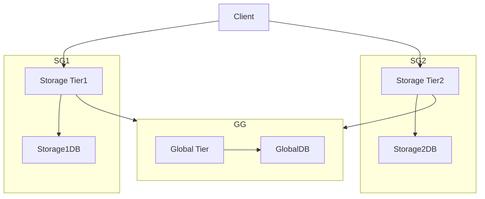

<!--
Copyright 2026 Sudhakar Narayanamurthy. All rights reserved.
Licensed under the Apache License, Version 2.0 (the "License")

Design, implementation contract, and verification for the TF Identity POC.
-->

# TF Identity POC
> Design, implementation contract, and verification for this repo. Contributors and coding agents should treat this document as the source of truth.

## Background
The goal of this project is to simulate a system that has several Region level Storage Tiers, and a global Global Tier. Teams are top-level entities managed by the Storage Tier. Teams contain folders.
Global Tier has a mapping of user to accessible teams. Storage Tier relies on Global Tier to know which teams are accessible to which users. 

## High level Requirements for the problem

* 3 services running locally (docker), one is the global tier and 2 are mimicking storage tier on 2 scale units
* The global tier exposes a discover API that takes a user token (claims include user ID and email) and returns back the teams that user is part of
* Storage tier exposes a list folders call that returns the list of folders in a team
* You can decide which database to use and bootstrap it with some sample data. No need of elaborate auth, go with something quick and simple.
*Once the setup is running, thru postman, run this calls – discover, list folders in a team user is a member of, try to list folders in a team user is not a member of (should fail)

## Block Diagram

## Interaction Flow
1. The Client goes to IDP and fetches a token. (For the POC, this is simulated as pre-signed JWT token.)
2. Client invokes Discovery API.
    * Discovery API is served by the Global Tier service.
    * Global Tier service provides two APIs:
        1. /Teams: Given a user token, return list of teams this user is part of. 
        2. The Storate Tier that the Teams lives in could be an attribute of the Team itself.
3. Client calls Storage Tier1's List Folders API to get the list of folders for a Team1. 
4. Storage Tier1 calls Global Tier's Discover API for the user.
    * Storage Tier will proxy caller's token to the Global Tier.
    * Global Tier will return teams that the user (subject of the token) is a member of.
5. If Global Tier finds the token invalid or user non-existent, it returns a 401 Unauthorized error. Storage Tier will propagate the error to the client.
6. If Team1 is not in the discover results, the Storage Tier returns a 403 Forbidden error.
7. If Team1 is in the discover results, but Team1 is missing in Storage Tier1's Storage1DB, the Storage Tier returns a 404 Not Found error.
8. If Team1 is in the discover results and Team1 is present in Storage Tier1's Storage1DB, the Storage Tier returns the list of folders for the team found in the database.

## Implementation choices and Technical primitives

### Discovery API and Global Service
#### Logical Web API contract
POST /discover?continuationToken=xxx
Authorization header: Bearer <JWT token with user claims>
Query:
{
  "teamIds": ["engineering", "marketing"]
}
Response:
{
  [
    {
      "teamId": "engineering",
      "storageTierId": 1
    },
    {
      "teamId": "marketing",
      "storageTierId": 2
    }
  ]
}

### Discovery API implementation
* Discovery data is global.
* Global tier service powers the Discovery API.
* Users are invited to Teams by Team Owner. This will send a magic link url to the user's email.
* User will click the link. This will invoke /provision API on the global tier with the magic, user email and teamID.
* Global tier will validate the magic link, and if valid, add the user team mapping in the global database.

### Global Service Availability design
* Global service (compute and DB) is hosted in a cluster that's MultiAZ. So it should be able to tolerate datacenter level failure.
* Region level outage:
    * We provision Compute in two seperate regions. 
    * Load Balancer directs call to closest region from caller (geo-proximity routing).
    * Say we are using Mongo Atlas for the DB. 
    * We create a Multi-region cluster with replicas in both regions (5: 3 in region1, 2 in region2).
    * Writes will go to the primary (in region1). 
    * There is some geo-latency challenge. If call lands in region2, it will go cross-region from compute to storage. 
    * We will setup a Virtual Private Connect / some type of connection so that traffic flows over the Cloud provider's backbone network. 
    * This will somewhat reduce the latency and make it more predictable.

### Service implementation
* We will implement in golang
* We will expose HTTP REST APIs
* **API contracts: OpenAPI 3.0 (Swagger)**.
    * REST + Postman is the stack; OpenAPI is the simplest way to describe request/response and import into Postman.
    * OpenAPI files in repo (no codegen required for v1):
        * [api/global.openapi.yaml](api/global.openapi.yaml) — Discover
        * [api/storage.openapi.yaml](api/storage.openapi.yaml) — List folders (same contract on tier 1 and tier 2)
    * For this POC, implement handlers by hand in Go. Keep YAML in sync with code (consider codegen as next step).
* We will implement the services as docker containers
* There will be 2 storage tiers, launched with ID 1 and 2 as startup arguments.
    * Same storage-tier image for both instances.
    * Compose differs only by: command / args (--tier-id=1 vs 2), ports, and env (e.g. DB name or connection targeting tier-1 vs tier-2 data).
* There will be one global tier.
* All the services will be launched with docker compose (global tier, two storage tiers, and a local MongoDB container).
* Services will be available at localhost:8080 for global tier, localhost:8081 for storage tier 1, and localhost:8082 for storage tier 2.
* Network and Communication:
    * All services will be accessible from localhost.
    * Global tier will be accessible from all storage tiers.
    * Storage tiers call global via `GLOBAL_TIER_URL` (Compose DNS, e.g. `http://global:8080`), not `localhost`.

### API Implementation
See [api/global.openapi.yaml](api/global.openapi.yaml) and [api/storage.openapi.yaml](api/storage.openapi.yaml) for full schemas.
All endpoints require `Authorization: Bearer <JWT>`.

**Global tier** (`localhost:8080`)

| Method | Path | Success | Body / notes |
|--------|------|---------|----------------|
| `GET` | `/health` | 200 | Liveness |
| `GET` | `/v1/discover` | 200 | `{ "teamIds": ["engineering", "marketing"] }` or `{ "teams": [{ "teamId", "storageTierId" }] }` |
| | | 401 | Missing/invalid JWT, or user not in GlobalDB |

**Storage tier** (`localhost:8081` / `:8082`)

| Method | Path | Success | Body / notes |
|--------|------|---------|----------------|
| `GET` | `/health` | 200 | Liveness |
| `GET` | `/v1/teams/{teamId}/folders` | 200 | `{ "teamId": "...", "folders": [{ "folderId", "name" }] }` |
| | | 401 | Missing/invalid JWT |
| | | 403 | User not in discover result for `teamId` |
| | | 404 | User allowed but team not provisioned on this tier |

### Database implementation
* We will use MongoDB for the database.
* **PoC default:** MongoDB runs in Docker Compose (`mongo:7` image, service name `mongo`, port `27017` published to the host for seed scripts).
* One MongoDB instance hosts all logical databases (no Atlas or external cluster required for the POC).
* **Connection string:** `MONGODB_URI` environment variable (e.g. `mongodb://mongo:27017` from app containers on the Compose network; `mongodb://localhost:27017` from the host when running mongosh scripts from `scripts/`).
* [scripts/run_mongosh.sh](scripts/run_mongosh.sh) runs one or more mongosh `.js` files against the local Mongo instance (waits for Mongo, resolves host vs Docker `mongosh`).
* [scripts/seed_test_data.js](scripts/seed_test_data.js) seeds all databases idempotently (upsert); [scripts/verify_test_data.js](scripts/verify_test_data.js) checks document counts. [run.sh](run.sh) runs both via `scripts/run_mongosh.sh` after startup.
* **GlobalDB** (MongoDB database `global`) — used by global tier; collections:
    * `user_team_memberships` — user to teams mapping
    * `team_storage_routing` — team to storage tier ID mapping
* **Storage1DB** (MongoDB database `storage_tier_1`) — used by storage tier 1; collection:
    * `teams` — one document per team on that tier; embedded `folders` array
* **Storage2DB** (MongoDB database `storage_tier_2`) — used by storage tier 2; collection:
    * `teams` — one document per team on that tier; embedded `folders` array
* Global tier reads `global` (GlobalDB); each storage tier reads its own `storage_tier_N` database (selected via env, e.g. `MONGODB_DATABASE=storage_tier_1` and `--tier-id=1`).

Team IDs are lowercase strings and must match across `team_storage_routing` and storage `teams._id`.
User IDs are stable strings; `user_team_memberships._id` must match the user ID claim in the JWT (`sub`). Email is stored for reference only, not used for membership lookup.

Sample data for collections:
* GlobalDB `global` (global tier)
  1. `user_team_memberships` — one document per user

    ```json
    {
      "_id": "usr_sudhakan",
      "email": "sudhakan@gmail.com",
      "teamIds": ["engineering", "marketing"]
    }
    ```

    Discover: read user ID from JWT → `findOne({ _id: userId })` → return `teamIds`.

  2. `team_storage_routing` — one document per team

    ```json
    { "_id": "engineering", "storageTierId": 1 }
    { "_id": "qa", "storageTierId": 1 }
    { "_id": "devops", "storageTierId": 1 }
    { "_id": "marketing", "storageTierId": 2 }
    { "_id": "sales", "storageTierId": 2 }
    ```

    Discover may return `teamIds` only, or `teams: [{ teamId, storageTierId }]` by joining memberships with routing.

* Storage1DB `storage_tier_1` — collection `teams`

    ```json
    {
      "_id": "engineering",
      "folders": [
        { "folderId": "code", "name": "Code" },
        { "folderId": "specs", "name": "Specs" }
      ]
    }
    {
      "_id": "qa",
      "folders": [
        { "folderId": "tests", "name": "Tests" },
        { "folderId": "results", "name": "Results" }
      ]
    }
    {
      "_id": "devops",
      "folders": [
        { "folderId": "infrastructure", "name": "Infrastructure" },
        { "folderId": "monitoring", "name": "Monitoring" }
      ]
    }
    ```

    List folders: `findOne({ _id: teamId })` → return `folders` (or 404 if missing).

* Storage2DB `storage_tier_2` — collection `teams`

    ```json
    {
      "_id": "marketing",
      "folders": [
        { "folderId": "campaigns", "name": "Campaigns" },
        { "folderId": "creative", "name": "Creative" }
      ]
    }
    {
      "_id": "sales",
      "folders": [
        { "folderId": "proposals", "name": "Proposals" },
        { "folderId": "contracts", "name": "Contracts" }
      ]
    }
    ```

    List folders: `findOne({ _id: teamId })` → return `folders` (or 404 if missing).


### Authentication (JWT) Implementation

* Authentication uses a JWT on every API call (`Authorization: Bearer <token>`).
* **Global** and **Storage** tiers validate the token (shared `JWT_SECRET` for PoC).
* **Membership lookup uses user ID only** — not email. Email is carried in the token and may be stored on the membership document but is not the database key.

JWT claims (PoC and production-shaped):

| Claim | Purpose |
|-------|---------|
| `sub` | **Canonical user ID** — must match `user_team_memberships._id` (e.g. `usr_sudhakan`) |
| `email` | User email (e.g. `sudhakan@gmail.com`) — logging/display; not used for DB lookup |
| `org_id` | Tenant/organization ID (reserved for multi-tenant; optional in PoC) |

For POC:
* Hand-crafted JWT in Postman.
* HMAC (`HS256`) validation with `JWT_SECRET` from `.env` (same secret on all services).
* Example payload: `{ "sub": "usr_sudhakan", "email": "sudhakan@gmail.com", "org_id": "org_acme" }`.
* Invalid or missing token → Unauthorized (`401`) error.

## Verification and Testing
Tool used for verification: curl (postman could also be used).
JWT user: `sub`: `usr_sudhakan`, `email`: `sudhakan@gmail.com`.
Test data: Populated from [scripts/seed_test_data.js](scripts/seed_test_data.js)

| Scenario | Service | Team ID | Expected |
|----------|---------|---------|----------|
| Discover | Global `:8080` | — | 200; `engineering`, `marketing` |
| List folders (member, correct tier) | Storage tier 1 `:8081` | `engineering` | 200; folders for engineering |
| List folders (not a member) | Storage tier 1 `:8081` | `qa` | 403 |
| List folders (member, wrong tier) | Storage tier 1 `:8081` | `marketing` | 404 |
| List folders (member, correct tier) | Storage tier 2 `:8082` | `marketing` | 200; folders for marketing |

## How to Run
1. Run [./run.sh](run.sh) to start the services, load test data and run all tests.
  * Tests for discover API are in [scripts/test_discover_api.sh](scripts/test_discover_api.sh)
  * Tests for list folders API are in [scripts/test_list_folders.sh](scripts/test_list_folders.sh)

2. Transcript from running [./run.sh](run.sh)
```log
 Building 3/3
 ✔ global          Built                                                                                                            0.0s 
 ✔ storage-tier-1  Built                                                                                                            0.0s 
 ✔ storage-tier-2  Built                                                                                                            0.0s 
==> starting services
==> seeding and verifying test data
==> waiting for MongoDB at mongodb://localhost:27017
==> running seed_test_data.js
seed complete: global (2 collections), storage_tier_1, storage_tier_2
==> running verify_test_data.js
{
  global_user_team_memberships: 1,
  global_team_storage_routing: 5,
  storage_tier_1_teams: 3,
  storage_tier_2_teams: 2
}
verify complete: all counts match expected seed data
==> health checks
  global:          {"status":"ok"}
  storage tier 1:  {"status":"ok","tierId":1}
  storage tier 2:  {"status":"ok","tierId":2}
==> stack is up

==> testing discover API
==> discover API smoke test (http://localhost:8080)
  discover (no auth):     401 OK
  discover (usr_sudhakan): 200 OK  {"teamIds":["engineering","marketing"],"teams":[{"teamId":"engineering","storageTierId":1},{"teamId":"marketing","storageTierId":2}]}
  discover (usr_unknown): 401 OK

==> testing list folders API
==> list folders API smoke test
  tier1 engineering (member): 200 OK  {"teamId":"engineering","folders":[{"folderId":"code","name":"Code"},{"folderId":"specs","name":"Specs"}]}
  tier1 qa (not a member): 403 OK
  tier1 marketing (wrong tier): 404 OK
  tier2 marketing (member): 200 OK  {"teamId":"marketing","folders":[{"folderId":"campaigns","name":"Campaigns"},{"folderId":"creative","name":"Creative"}]}
  tier1 no auth: 401 OK

==> All good!
```
## TODO
Modify design to support these invariants and update implementation accordingly.
1. Multiple Clouds
2. Storate Tier and DB in multiple regions.
3. MongoDB Atlas, CockroachDB, MySQL. Think thru.