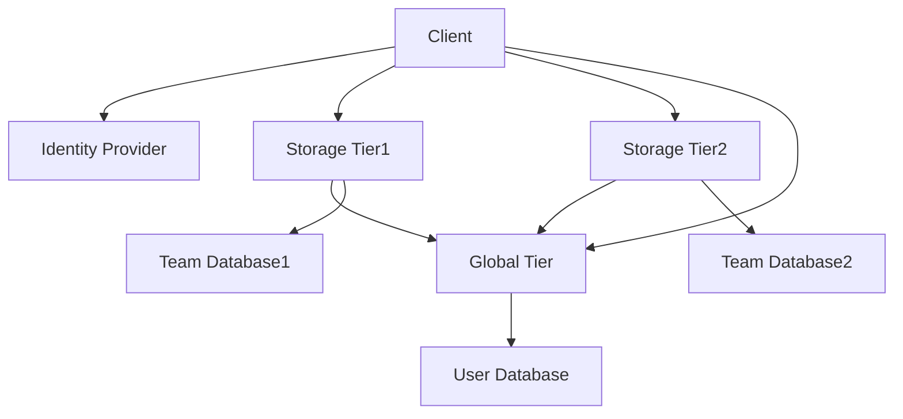

# Background
The goal of this project is to simulate a system that has several Region level Storage Tiers, and a global Global Tier. Teams are top-level entities managed by the Storage Tier. Teams contain folders.
Global Tier has a mapping of user to accessible teams. Storage Tier relies on Global Tier to know which teams are accessible to which users. 

# High level Requirements for the problem

* 3 services running locally (docker), one is the global (or identity) tier and 2 are mimicking storage tier on 2 scale units
* The global tier exposes a discover API that takes a user token (claim includes email) request and returns back the teams that user is part of
* Storage tier exposes a list folders call that returns the list of folders in a team
* You can decide which database to use and bootstrap it with some sample data. No need of elaborate auth, go with something quick and simple.
*Once the setup is running, thru postman, run this calls – discover, list projects in a team user is a member of, try to list projects in a team user is not a member of (should fail)

## Block Diagram

## Interaction Flow
1. The Client goes to IDP and fetches a token. (For the POC, this is simulated as pre-signed JWT token.)
2. Client calls Storage Tier1's List Folders API to get the list of folders for a Team1. 
3. Storage Tier1 calls Global Tier's Discover API.
4. If Team1 is not in discovery results, the Storage Tier returns a 403 Forbidden error.
5. If Team1 is in discovery results, but Team1 is missing in Storage Tier1's Team Database, the Storage Tier returns a 404 Not Found error.
6. If Team1 is in discovery results and Team1 is present in Storage Tier1's Team Database, the Storage Tier returns the list of folders for the team found in the database.

## Implementation choices and Technical primitives

### Service implementations:
* We will implement in golang
* We will expose HTTP REST APIs 
* We will implement the services as docker containers
* There will be 2 storage tiers, launched with ID 1 and 2 as startup arguments.
    * Same storage-tier image for both instances.
    * Compose differs only by: command / args (--tier-id=1 vs 2), ports, and env (e.g. DB name or connection targeting tier-1 vs tier-2 data).
* There will be one global tier.
* All the services will be launched with docker compose.
* Services will be available at localhost:8080 for global tier, localhost:8081 for storage tier 1, and localhost:8082 for storage tier 2.
* Network and Communication:
    * All services will be accessible from localhost.
    * Global tier will be accessible from all storage tiers.

### Storage implementation:
* We will use MongoDB Atlas cluster as the storage for the project.
* We can expect Mongo Atlas connection string to be saved as an environment variable. 
    * There will be a .env file in the root of the project that will contain the environment variables.
* We will have a load_test_data.sh script that will load the test data into the database.
* Identity database will be a MongoDB Atlas database with collections for:
    * users to teams mapping (user_team_memberships collection)
    * teams to storage tier ID mapping (team_storage_routing collection)
* Storage tier 1 database (`storage_tier_1`) with collection:
    * `teams` — one document per team on that tier; embedded `folders` array
* Storage tier 2 database (`storage_tier_2`) with collection:
    * `teams` — one document per team on that tier; embedded `folders` array

Team IDs are lowercase strings and must match across `user_team_memberships`, `team_storage_routing`, and storage `teams._id`.

Sample data for collections:
* Identity DB (global tier)
  1. `user_team_memberships` — one document per user

    ```json
    {
      "_id": "sudhakan@gmail.com",
      "teamIds": ["engineering", "marketing"]
    }
    ```

    Discover: `findOne({ _id: email })` → return `teamIds`.

  2. `team_storage_routing` — one document per team

    ```json
    { "_id": "engineering", "storageTierId": 1 }
    { "_id": "qa", "storageTierId": 1 }
    { "_id": "devops", "storageTierId": 1 }
    { "_id": "marketing", "storageTierId": 2 }
    { "_id": "sales", "storageTierId": 2 }
    ```

    Discover may return `teamIds` only, or `teams: [{ teamId, storageTierId }]` by joining memberships with routing.

* Storage DB `storage_tier_1` — collection `teams`

    ```json
    {
      "_id": "engineering",
      "folders": [
        { "folderId": "code", "name": "Code" },
        { "folderId": "specs", "name": "Specs" }
      ]
    }
    {
      "_id": "qa",
      "folders": [
        { "folderId": "tests", "name": "Tests" },
        { "folderId": "results", "name": "Results" }
      ]
    }
    {
      "_id": "devops",
      "folders": [
        { "folderId": "infrastructure", "name": "Infrastructure" },
        { "folderId": "monitoring", "name": "Monitoring" }
      ]
    }
    ```

    List folders: `findOne({ _id: teamId })` → return `folders` (or 404 if missing).

* Storage DB `storage_tier_2` — collection `teams`

    ```json
    {
      "_id": "marketing",
      "folders": [
        { "folderId": "campaigns", "name": "Campaigns" },
        { "folderId": "creative", "name": "Creative" }
      ]
    }
    {
      "_id": "sales",
      "folders": [
        { "folderId": "proposals", "name": "Proposals" },
        { "folderId": "contracts", "name": "Contracts" }
      ]
    }
    ```

    List folders: `findOne({ _id: teamId })` → return `folders` (or 404 if missing).


### Identity and Auth Token:
* We will use a JWT token for authentication.
* The Service Tier will validate the token and extract the user email from the token.
* For POC:
    * We will hand-craft the token in the client. 
    * Token validation will be based on a HMAC signature. (With a real identity provider, we would use a public key to validate the token.)
    * Token will contain user email as the subject.
    * Token will contain a userID as a claim.
    * token will contain tenantID or organizationID as a claim.

### Postman test scenarios (JWT claim email: `sudhakan@gmail.com`):

| Scenario | Service | Team ID | Expected |
|----------|---------|---------|----------|
| Discover | Global `:8080` | — | 200; `engineering`, `marketing` |
| List folders (member, correct tier) | Storage tier 1 `:8081` | `engineering` | 200; folders for engineering |
| List folders (not a member) | Storage tier 1 `:8081` | `qa` | 403 |
| List folders (member, wrong tier) | Storage tier 1 `:8081` | `marketing` | 404 |
| List folders (member, correct tier) | Storage tier 2 `:8082` | `marketing` | 200; folders for marketing |