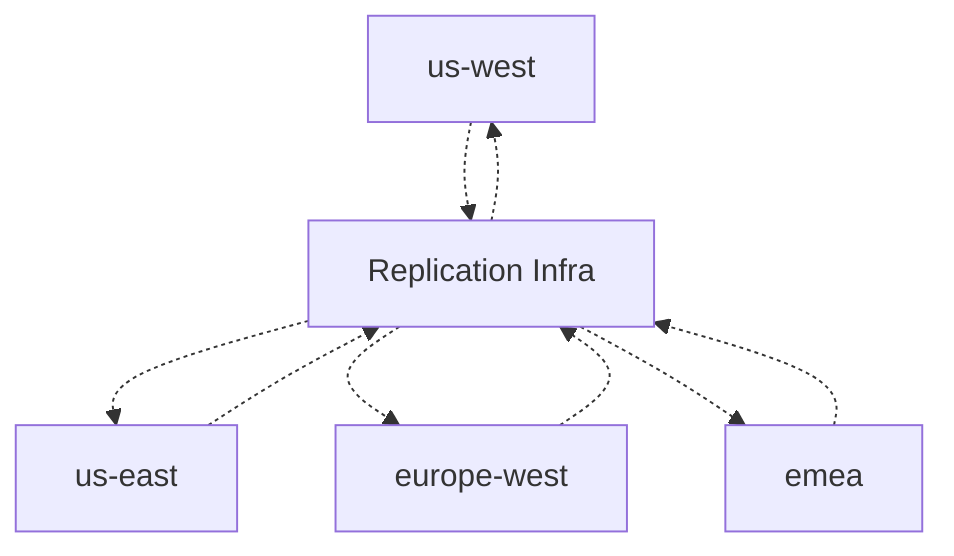
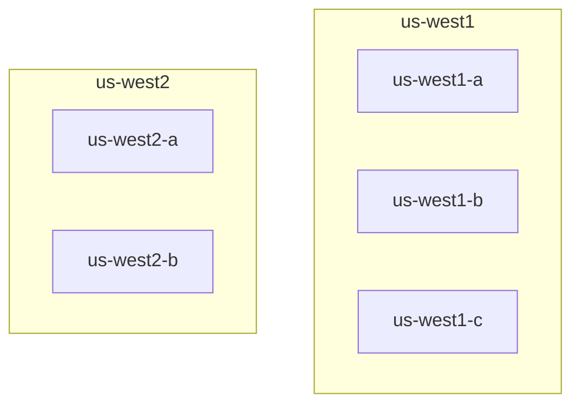

# Evaluation: Global DirectoryDB and Directory Service

## Context
We are evaluating storage and service architecture for a global
DirectoryDB used by a distributed system accessed by users across the
globe.

The system has:
- Users
- Teams
- Capacity Units
- Directory service
- DirectoryDB

Each team is hosted in a Capacity Unit. Capacity Units are deployed
across regions and may run on different cloud providers.

The Directory service stores global metadata such as:
- which users have access to which teams
- which Capacity Unit hosts each team
- url for the Capacity Unit

This Directory data is global control-plane data. It sits outside any
individual Capacity Unit and is used for authorization, routing, and
discovery.

## Workload
The Directory workload is expected to be read-heavy.

Primary read paths include:
- Authorization lookup: determine whether a user has access to a team.
- Routing lookup: determine which Capacity Unit hosts a team.

Writes are less frequent and typically occur during Provisioning and Management operations, such as:
- inviting a user to a team
- removing a user from a team
- creating or deleting a team
- moving a team between Capacity Units
- updating Capacity Unit metadata

## Requirements
1. The Directory service (and DB) must be hosted so that geo-latency to reach it is minimal 
for clients. These clients can be present anywhere in the world, and we would prefer
client calls to be served from a region close to them.

2. The Directory service (and DB) must remain highly available across infrastructure
failures, including:
- Availability zone failure
- Single Region failure
- Single Cloud provider failure
In essense, the deployment must be multi-region and multi-cloud.

3. The baseline consistency goal is read-your-writes consistency.
* If a client performs an update, subsequent reads by that same client must
observe the updated Directory state.
* Other clients may observe the update after some delay. The acceptable
propagation delay is a design parameter and may vary by operation type.

4. We absolutely want to avoid data correctness issues while provisioning or management operations.
We can tolerate higher write latency, but we do not want lost updates, conflicting updates, or other correctness issues.

## Implementation choices
Directory service compute is stateless and can be deployed in multiple regions and clouds.
The DirectoryDB storage is the stateful and crucial component. We will evaluate different models for DirectoryDB. We can then align Compute along with Storage.

For the DB, we will consider a suitable member from SQL and NoSQL families.
1. MongoDB / Mongo Atlas for NoSQL
2. CockroachDB / Cockroach Cloud for SQL.

### Model A: GeoArea Clusters with App-Managed Replication
Here, each cluster will be a multi-region multi-AZ cluster serving some geographical area (GeoArea).

Each User (or Team) will be tied to a GeoArea during provisioning. Each GeoArea will be served by one (Multi-Region Multi-AZ) cluster. Write operations for that User (or Team) will be done only by cluster serving that GeoArea. However, all clusters will have the full DirectoryDB.

Each Cluster can be hosted in a cloud provider across *two or three regions* that are close latency-wise. (E.g., us-west1 and us-west2 in GCP). 

We can use different cloud providers for different clusters. This is a big advantage in this model.

Replication across GeoArea Clusters will be Asynchronous. 
* This replication will managed by the Application (A Sync background service). 
* This replication can be done either at App level (Directory API-level events), or DB level (CDC events). 
* We use some PubSub infra to disseminate and apply these events.
* Sync service from a Cluster publishes events into its Topic/Queue
* Sync service from Clusters subscribe to this Topic, and apply to their DB.
* Since any row can only be updated in one Cluster (whichever Cluster serves that row's GeoArea), conflicts will not happen.

#### MongoDB
* Cluster can be deployed across two regions, or three regions.
* With 2 regions, when. With 3 regions, a single region outage can be tolerated without failover. But latency between the regions should be low enough for synchronous replication.
* Two region model
  * The cluster can have 5 voting replicas spread across 2 regions. Keep each replica in different AZ.
  * It can tolerage outage of any AZ. When smaller region (us-west2) fails, there is no impact. Cluster is up. When the larger region (us-west1) fails, manual failover is     needed.
  * During normal functioning, quorum can be achieved across AZs in same region (e.g., us-west1-a, us-west1-b). So it will be faster.
* Three region model
  * Cluster will have 5 replicas across 3 regions (2:2:1).
  * Cluster can tolerate any region failure without failover.
  * However regions need to be close enough - else latency will impact.
* Reference: https://www.mongodb.com/docs/atlas/architecture/current/deployment-paradigms/multi-region

#### CockroachDB
CockroachDB gives first-class SQL transactions and serializable isolation within a
cluster. This is useful for Provisioning and Management operations because
membership changes, team creation, team moves, and Capacity Unit updates can
be expressed as transactional updates with uniqueness constraints, foreign
keys, and compare-and-set style version checks.

CockroachDB can be used in the same per-GeoArea model, where each GeoArea
has its own CockroachDB cluster and the Directory service treats that
cluster as the write authority for users or teams homed in that GeoArea. 

Within a GeoArea cluster:
* Prefer a 3-region topology if we need the cluster to remain available during
  a full region outage without manual intervention.
* Use the CockroachDB multi-region abstractions with `SURVIVE REGION FAILURE`
  for data where a region outage must not stop reads or writes.
* Use `SURVIVE ZONE FAILURE` if the GeoArea only needs AZ-level availability
  and we want lower write latency.
* Keep the regions latency-close. CockroachDB replication is synchronous for
  committed writes, so write latency is tied to the latency needed to reach a
  write quorum.
* Reference:
  https://www.cockroachlabs.com/docs/stable/multiregion-overview.html

### Model B: Managed Global Database
In this model:
* Directory service compute is deployed close to clients in all target regions.
* All Directory service instances connect to one logical global database.
* The database handles regional data placement and replication.
* Directory writes are coordinated by the database, avoiding app-managed
  cross-GeoArea conflict resolution.

In this model, the replication and consistency is handled by the database. This is a big benefit.

However, multi-provider deployment does not seem to be supported. We need to go with one provider. This is a limitation.

#### MongoDB
We will use Global Clusters as described here: https://www.mongodb.com/docs/atlas/global-clusters/. Mongo Global cluster has concept of a `Zone` that's related to our GeoArea. Each row in the table is associated with a Zone.

MongoDB Atlas Global Cluster with Zones:
- Optimizes writes and primary reads for each document's home GeoArea.
- Can provide low-latency reads from other GeoAreas only by placing read-only
  secondary nodes for each zone in those other GeoAreas and using nearest/tagged
  secondary read preferences.
- Remote fast reads are eventually consistent and may observe replication lag.
- Queries must include the shard key/location field to avoid scatter-gather reads.

We use Zone to map documents to geographically local shards. We need to design the cluster to make sure:
  1. Voting replicas of a Zone are in proximity to the GeoArea it serves. That way
     Writes are low-latency in this GeoArea.
  2. Non-voting replicas are spread across other GeoAreas. This will make sure
     Reads are low latency globally.

Global Cluster can support up to nine distinct Zones. This is a tight limit if GeoArea maps 1:1 to Zone.

#### CockroachDB
CockroachDB also supports global database instead of separate per-GeoArea databases with application-managed replication.

For table placement, there are two useful patterns:
* `REGIONAL BY ROW` for rows that have a clear home GeoArea, such as user-team
  membership and team routing records. This keeps reads and writes for a
  homed user or team close to that GeoArea.
* `GLOBAL` for tables that need low-latency reads from all regions in the cluster. 
  Writes to `GLOBAL` tables have higher latency and should be reserved for read-mostly
  data.

In our case, we can model the Users and Teams as GLOBAL table. This will give low latency reads, but writes will be somewhat higher latency.

