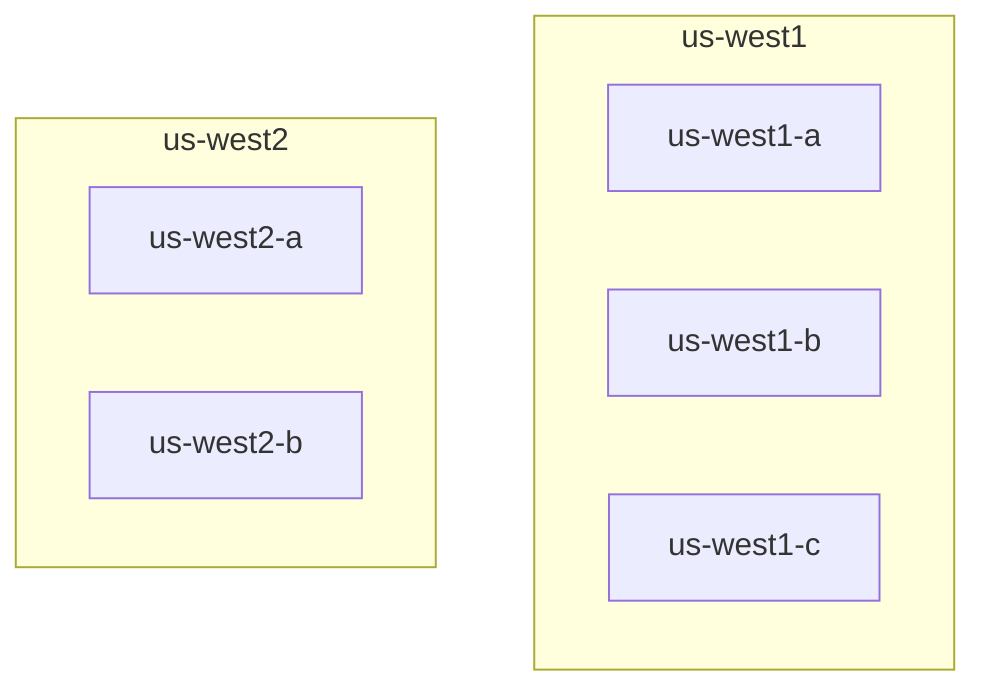
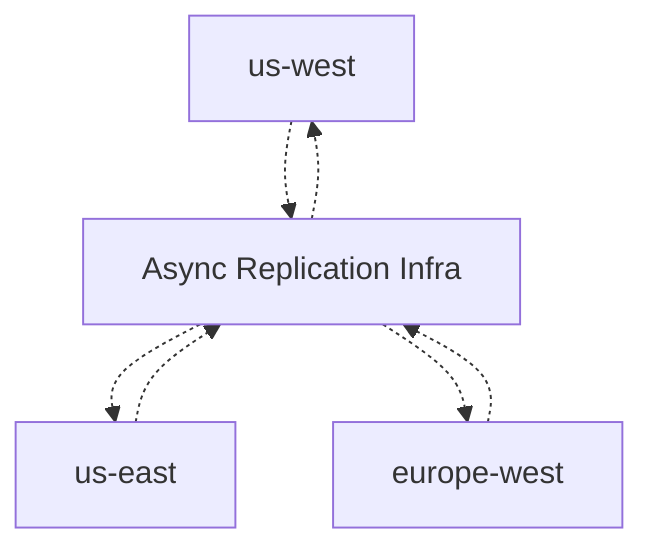

# Evaluation: Global DirectoryDB and Directory Service

## Context
We are evaluating storage and service architecture for a global
DirectoryDB used by a distributed system accessed by users across the
globe.

The system has:
- Users
- Teams
- Capacity Units
- Directory service
- DirectoryDB

Each team is hosted in a Capacity Unit. Capacity Units are deployed
across regions and may run on different cloud providers.

The Directory service stores global metadata such as:
- which users have access to which teams
- which Capacity Unit hosts each team
- url for the Capacity Unit

This Directory data is global control-plane data. It sits outside any
individual Capacity Unit and is used for authorization, routing, and
discovery.

## Workload
The Directory workload is expected to be read-heavy.

Primary read paths include:
- Authorization lookup: determine whether a user has access to a team.
- Routing lookup: determine which Capacity Unit hosts a team.

Writes are less frequent and typically occur during Provisioning and Management operations, such as:
- inviting a user to a team
- removing a user from a team
- creating or deleting a team
- moving a team between Capacity Units
- updating Capacity Unit metadata

## Requirements
1. The Directory service (and DB) must be hosted so that geo-latency to reach it is minimal 
for clients. These clients can be present anywhere in the world, and we would prefer
client calls to be served from a region close to them.

2. The Directory service (and DB) must remain highly available across infrastructure
failures, including:
- Availability zone failure
- Single Region failure
- Single Cloud provider failure
In essense, the deployment must be multi-region and multi-cloud.

3. The baseline consistency goal is read-your-writes consistency.
* If a client performs an update, subsequent reads by that same client must
observe the updated Directory state.
* Other clients may observe the update after some delay. The acceptable
propagation delay is a design parameter and may vary by operation type.

4. We absolutely want to avoid data correctness issues while provisioning or management operations.
We can tolerate higher write latency, but we do not want lost updates, conflicting updates, or other correctness issues.

## Implementation choices
Directory service compute is stateless and can be deployed in multiple regions and clouds.
The DirectoryDB is the stateful and crucial component - how we meet requirements.
For this, we will evaluate two storage models.

### Candidate storage technologies
We will use two strong candidates in the SQL and NoSQL family:
1. MongoDB / Mongo Atlas for NoSQL
2. CockroachDB / Cockroach Cloud for SQL.

We will evaluate these technologies in two storage models described below.

### Model A: Self-Managed Active-Active Replication
Directory remains read-available globally during zone, region, or
provider outages. Writes may pause or require failover during region or provider outage.

#### MongoDB
##### Within Cluster
* Each cluster will be a multi-region multi-AZ cluster serving some geographical area (GeoArea).
* It hosted in a cloud provider across two regions that are close. (E.g., us-west1 and us-west2 in GCP). This reduces latency for synchronous replication.
* The cluster can have 5 voting replicas spread across 4 availability zones in two regions supported by single provider: us-west1-a, us-west1-b, us-west2-a, us-west2-b.
* During normal functioning, quorum can be achieved across AZs in same region (us-west1a, us-west1b, us-west1c)
* During outage of any one AZ, quorum will span regions. But since they are geographically close (us-west1 and us-west2), functioning will still be reasonable.
* Reference: https://www.mongodb.com/docs/atlas/architecture/current/deployment-paradigms/multi-region

#### Across Clusters
* Each User (or Team) will be tied to a GeoArea during provisioning.
* Each GeoArea will be served by one (Multi-Region Multi-AZ) cluster
* Write operations for that User (or Team) will be done only by cluster serving that GeoArea.
* However, all clusters will have the full DirectoryDB
* Directory Service will have a CDC Replication to propagate changes across GeoAreas.
* This replication can be done either at:
  * App level (Directory Service API)
  * MongoDB CDC stream.

#### Failure modeling
1. AZ failure. When one AZ in one region fails, Mongo Cluster will adjust.
2. Region failure. 
  * When the smaller region (us-west2) fails, there is no impact. Cluster is up.
  * When the larger region (us-west1) fails, manual failover is needed.
  * For bigger / more popular region, there is a 7 replica setup spanning 3 regions where region outage can be tolerated. But it'll cost more. Use it for bigger regions.
3. Cloud provider or GeoArea failure.
  * A cloud provider failure will be similar to a GeoArea failure.
  * A manual failover has to be initiated. As part of failover.
    * All Teams and Users in affected GeoArea will homed to a different GeoArea
    * A different cluster will takeover for write workload

### Model B: Managed Global Clusters
We will use global clusters here: https://www.mongodb.com/docs/atlas/global-clusters/
* Here, here is concept of a `Zone` that's related to our GeoArea.
* The Global Cluster can support 70 shards, with upto 50 replicas with 7 voting replicas per shard.
* We need to design the cluster to make sure:
1. Voting replicas of a Zone are in proximity to the GeoArea it serves.
2. Non-voting replicas are distributed across other GeoAreas.

