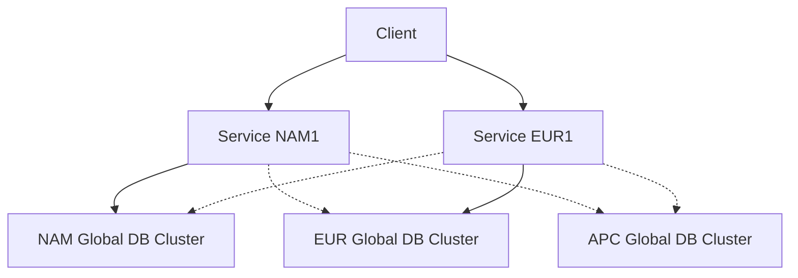
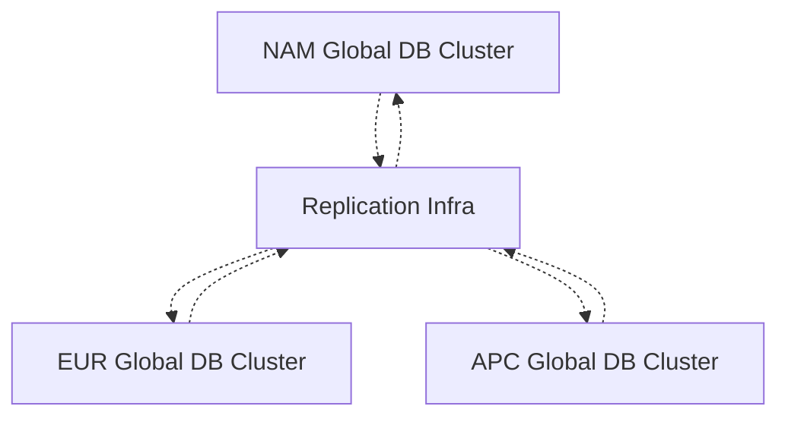
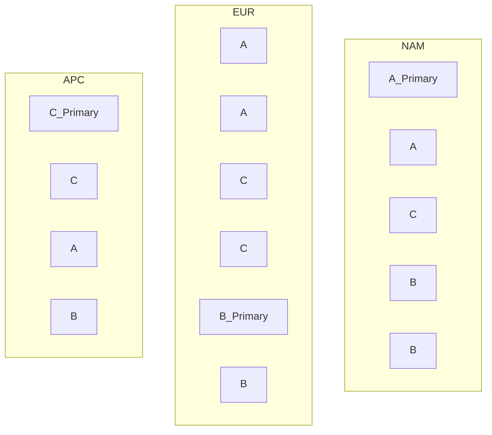

# Implementing a Global Service with High Availability and Low Latency
We want to evolve an architecture for a Global Directory used in a distributed system
with high availability and low latencies across the globe.

## Background
In most big multi-tenant systems, there are some top-level entities that are used acoss the system.
Example: Users, Tenants, Organizations, Workspaces, Teams, etc.

This pattern is common and can be seen in multiple systems:
1. In Exchange Online, there are Users, Organizations and Mailboxes.
2. In Azure Resource Manager, there are Subscriptions, Resource Groups and Resources.

These top-level entities are typically used for discovery, authorization and routing. They answer questions such as:
- Set of all Users in an Organization.
- Set of Organizations a User is part of.
- What Mailboxes can a user access.
- Which Capacity Unit hosts which Mailbox.
- URL to the Capacity Unit / Mailbox.

Entities underneath the top-level entities are typically homed in one of many Capacity Units
that are deployed in several regions.

**The harder question we try to answer here is, how do we implement a Global service
to support these top-level entities?**

These are accessed from multiple Capacity Units and Clients from various regions. In which region do we deploy the Global service? How do we ensure their availability. And how we reduce geo-latency to access them.

## Requirements
1. The Global service (and DB) must be hosted so that geo-latency to reach it is minimal
for Clients and Capacity Units. Callers can be present anywhere in the world, and we
would prefer calls to be served from a region close to them.

Some of the top-level objects have a geo affinity. E.g., Users have addresses they typically
work from. Organzation have data residency requirements within a region. Teams are
typically operate from a office in one location, etc.

Design must exploit such affinities to give optimal latency. But work globally otherwise too.

2. The Global service (and DB) must remain highly available across infrastructure
failures, including:
- Availability zone failure
- Single Region failure
- Single Cloud provider failure
In essense, the deployment must be multi-region and multi-cloud.

3. Global service should be optimal for a read-heavy workload.
The top level objects are typically read more often than written. Read scenarios include:
- Authorization lookup: determine whether a user has access to a team.
- Routing lookup: determine which Capacity Unit hosts a team.

Writes are less frequent and typically occur during Provisioning and Management
operations, such as:
- inviting a user to a team
- removing a user from a team
- creating or deleting a team
- moving a team between Capacity Units
- updating Capacity Unit metadata

Design should be optimal for former, and reasonable for latter.

4. We absolutely want to avoid data correctness issues while provisioning or management operations.
We can tolerate some latency (design parameter to be minimized), but we do not want lost updates, conflicting updates, or other correctness issues even when access across regions.

## Architectural models
The Global service (compute) is stateless. Global Service instances can be
deployed in multiple regions / providers, and are typically deployed in several
edge locations to remain close to users.

The Global DB (storage) is the data used by the Global service. A Global DB cluster
is a physical database cluster that houses the Global DB. The deployment and usage
of Global DB clusters is the trickier part of the design.

In the models below:
- Owner DB cluster means the Global DB cluster currently allowed to write a GeoShard.
- Replica DB cluster means a Global DB cluster holding an async replicated copy of a GeoShard.

We will look at two architectural models. We will assess implementing each with suitable member from the broad SQL and NoSQL families:
1. MongoDB / Mongo Atlas for NoSQL
2. CockroachDB / Cockroach Cloud for SQL.

### Model A: Multi-Active GeoArea DB Clusters
Here, we will deploy Global DB clusters in each Geographic Area (`GeoArea`) we want to support. Each Global DB cluster will be multi-AZ single-region hosted by some cloud provider in that geographical area (GeoArea).

For instance, we could support North America (NAM), Europe (EUR), Asia Pacific (APC) as our three GeoAreas. We can correspondingly have three Global DB clusters, say in us-west1, europe-west1 and asia-southeast2. Each Global DB cluster could use 3 Availability Zones within the region. We can use different cloud providers for different Global DB clusters. Cross-provider support is a big advantage in this model.

Global Service instances can be deployed in many more regions - say us-west1, us-west2, europe-west1, europe-east1, etc. The Service instances will all use these three Global DB clusters.

All rows or documents in any table or collection of the global data will be part of a
application level shard. Say we call this `GeoShard`. Location aware objects like User (or Team) can be tied to a GeoShard during provisioning based on user's location. Location independent can be placed in some GeoShard based on some consistent hashing. The shard
is present as `GeoShardId` on the row or document.

All GeoShards will be present in all Global DB clusters, and all Global DB clusters are active. Hence the name: `Multi-Active GeoArea DB Clusters`.

However, Write operations for a GeoShard will happen only from one Owner DB cluster. **This is the key design invariant that preserves data consistency**. While all Global DB clusters are active and all of them can handle traffic, update for a row or document will happen only at the Owner DB cluster. We will have a mapping of GeoShardId to Owner DB cluster as a metadata table.

Read operations for a GeoShard can happen from any Global DB cluster. However, Service instances
will preserve affinity for a client: if it used a Global DB cluster for a client recently,
it will use the same. That way, an update was recently done, subsequent requests from client
go to same Global DB cluster (for read-your-own-writes)

#### Geo-latency
Client call will land on the regional service deployment that is closest in terms of geo-latency
via some Global External Load Balancer or Frontdoor.

For read requests, the Service instance will invoke the Global DB cluster that's closest. This
can again be done by some Load Balancer via Shared URL. E.g.,
any Service instance in NAM will end up calling NAM Global DB cluster for low latencies.

For write requests, the Service instance will explicitly invoke the Owner DB cluster
that owns the GeoShard in question. This may be a relatively expensive call.

#### Replication
Replication across GeoArea DB clusters will be Asynchronous. Note that this replication has to be:
1. Bidirectional. Any two Global DB clusters will exchange CDC events for GeoShards they write to.
2. Multi-way. A Global DB cluster could send and receive events from more than one Global DB cluster.
This type of Bidirectional Multi-Way replication is not supported natively by Database systems.

So we will build them over CDC Events.
* This replication will be managed by the Application (A Sync background service).
* We will gather DB level CDC events for each Global DB cluster.
* We use some PubSub infra to disseminate and apply these events
* Sync service from a Global DB cluster publishes events into its Topic/Queue
* Sync service from Global DB clusters subscribe to this Topic, and apply to their DB.
* Since any row can only be updated in one Owner DB cluster (whichever Global DB cluster serves that row's
  GeoArea), conflicts will not happen.
* Every entity will have a monotonically increasing Revision number to run
  consistency checks and do reconciliation.

#### Failure model and Failovers
In this model, Service instance failure is transparent. Client call will reach
a different regional Service instance via Global Load Balancer or Frontdoor. The Global service
is truly Active-Active.

Single Availability Zone(AZ) Failure can be tolerated in a Global DB cluster, as it spans three AZs.

If there is a Region Failure, the corresponding Global DB cluster will be down.
  * However Read traffic can continue to be served by some other Global DB cluster.
  * Write traffic to unaffected GeoShards continues to get served.
  * For Failover, the failed Global DB cluster is put in maintenance mode and Metadata tables
    mapping GeoShard to Owner DB cluster need to be updated. Then Service instances will go to the new
    Owner DB cluster for affected GeoShards.

Cloud Provider failure will be similar to Region failure. Some Global DB clusters may go down.
But other Global DB clusters (using different Cloud Providers) will serve Read Traffic.
And Failover can be done to these Global DB clusters for affected GeoShards.

### Model B: Managed Global Database
In this model, we try to push the replication into the database itself by
creating a managed multi-region Global DB cluster.

Service instances are deployed close to clients in all/multiple regions.

All Service instances connect to one managed Global DB cluster that's spread across
at least 3 regions, and 6 AZs.

In the above example:
1. GeoShard (and underlying ReplicaSet hosting it) A has its primary node in NAM
2. GeoShard A also has its secondary nodes in EUR and APC.
3. Replication between the Primary and Secondary node is handled by the database.

In this model, the replication and consistency is handled by the database. This is a big benefit.

However, multi-provider deployment does not seem to be supported. We need to go with one provider. This is a limitation.

#### MongoDB
We will use Global Clusters as described here: https://www.mongodb.com/docs/atlas/global-clusters/. Mongo Global cluster has concept of a `Zone` that's related to our GeoArea. Each row in the table is associated with a Zone.

MongoDB Atlas Global Cluster with Zones:
- Optimizes writes and primary reads for each document's home GeoArea.
- Can provide low-latency reads from other GeoAreas only by placing read-only
  secondary nodes for each zone in those other GeoAreas and using nearest/tagged
  secondary read preferences.
- Remote fast reads are eventually consistent and may observe replication lag.
- Queries must include the shard key/location field to avoid scatter-gather reads.

We use Zone to map documents to geographically local shards. We need to design the cluster to make sure:
  1. Voting replicas of a Zone are in proximity to the GeoArea it serves. That way
     Writes are low-latency in this GeoArea.
  2. Non-voting replicas are spread across other GeoAreas. This will make sure
     Reads are low latency globally.

Global Cluster can support up to nine distinct Zones. This is a tight limit if GeoArea maps 1:1 to Zone.

#### CockroachDB
CockroachDB also supports global database instead of separate per-GeoArea databases with application-managed replication.

For table placement, there are two useful patterns:
* `REGIONAL BY ROW` for rows that have a clear home GeoArea, such as user-team
  membership and team routing records. This keeps reads and writes for a
  homed user or team close to that GeoArea.
* `GLOBAL` for tables that need low-latency reads from all regions in the cluster.
  Writes to `GLOBAL` tables have higher latency and should be reserved for read-mostly
  data.

In our case, we can model the Users and Teams as GLOBAL table. This will give low latency reads, but writes will be somewhat higher latency.
